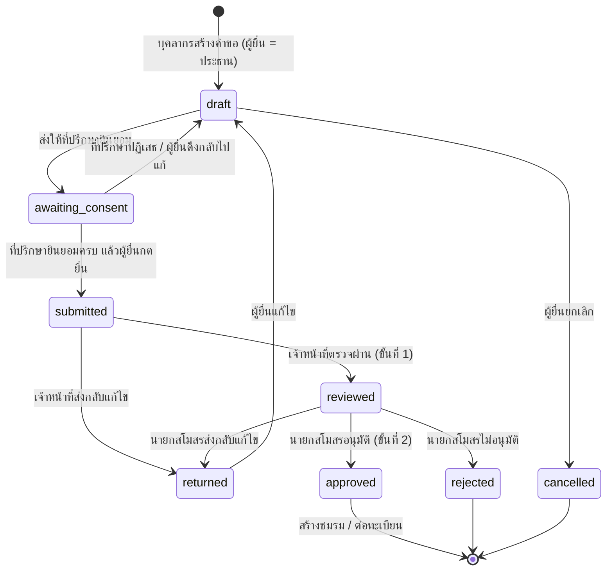

# การออกแบบ: การจัดตั้งและบริหารชมรม (v0.3 — ยืนยันแล้ว)

> สถานะ: **ยืนยันแล้ว** (หัวข้อ 2, 3 และข้อ A–D ในหัวข้อ 8; ผูก `club_application:create` กับ role `staff`) — ข้อที่มี ❓ ยังรอคำตอบ
> อ้างอิง: เอกสารการจัดตั้งชมรม สังกัดสโมสรบุคลากร มหาวิทยาลัยมหาสารคาม ประจำปีการศึกษา ๒๕๖๙ (16 หน้า)
> และประกาศมหาวิทยาลัยฯ เรื่อง แนวปฏิบัติด้านกิจกรรมบุคลากร พ.ศ. ๒๕๔๙ หมวด ๑๓ (ชมรมและกลุ่ม)

---

## 0. ข้อตัดสินใจที่ยืนยันแล้ว

| # | เรื่อง | ข้อตัดสินใจ |
|---|---|---|
| 1 | การอนุมัติ | **2 ขั้น**: เจ้าหน้าที่สโมสรตรวจ → นายกสโมสรอนุมัติ |
| 2 | ที่ปรึกษา | ผู้ยื่นระบุด้วย **ชื่อหรือ email** ไว้ก่อน ที่ปรึกษาต้อง **login แล้วกดยินยอมในระบบ** |
| 3 | กรรมการ/สมาชิก | ต้องเป็น **ผู้ที่เคย login แล้วทุกคน**, สมาชิกตั้งต้น **ขั้นต่ำ 5 คน** |
| 4 | ตำแหน่งกรรมการ | **ยืดหยุ่น** (มีรายการตำแหน่งมาตรฐานให้เลือก + ตั้งชื่อตำแหน่งเองได้) |
| 5 | รอบปี | **ปีงบประมาณ** (1 ต.ค. – 30 ก.ย.) เก็บเป็นปี พ.ศ. เช่น ปีงบประมาณ 2570 = 1 ต.ค. 2569 – 30 ก.ย. 2570 |
| 6 | ระเบียบข้อบังคับ | ใช้ **แม่แบบมาตรฐานเป็นค่าตั้งต้น** แต่ละชมรม **แก้ไขเพิ่มเติมได้** |
| 7 | สิทธิ์ระดับชมรม | **เพิ่ม** โดย Claude ออกแบบตำแหน่งและสิทธิ์ (หัวข้อ 3) |

---

## 1. สิ่งที่ได้จากเอกสาร

### 1.1 ชุดเอกสารขอจัดตั้ง (11 รายการ) → ข้อมูลที่ระบบต้องเก็บ

| # | เอกสาร | ข้อมูลที่ต้องเก็บ |
|---|---|---|
| 1 | แบบขอจัดตั้งชมรม (หน้า 3) | ชื่อชมรม, ผู้ยื่น (ประธานชมรม) + สังกัด, วันที่ยื่น, ลายเซ็นประธาน + ที่ปรึกษา 2 คน, เรียน นายกสโมสรบุคลากร |
| 2 | บันทึกเสนอชื่อที่ปรึกษา (หน้า 4) | ที่ปรึกษา ≤ 2 คน (ชื่อ, สังกัด), ช่วงวาระตามปีงบประมาณ |
| – | คำยินยอมของที่ปรึกษา (หน้า 5) | การยินยอมของที่ปรึกษาแต่ละคน + วันที่ |
| 3 | ประวัติชมรม (ถ้ามี) (หน้า 6) | ข้อความยาว |
| 4 | ข้อมูลผู้ประสานงาน (หน้า 7–8) | กรรมการทุกคน: ชื่อ, ตำแหน่ง, สถานที่ทำงาน, เบอร์โทร |
| 5 | ตราสัญลักษณ์ คำขวัญ ความหมาย (หน้า 9) | รูปตราสัญลักษณ์ (ไฟล์), คำขวัญ, ความหมายของตรา |
| 6 | วัตถุประสงค์ (หน้า 9) | รายการข้อ ๆ |
| 7 | ระเบียบข้อบังคับ (หน้า 10–13) | แม่แบบมาตรฐาน + แก้ไขเพิ่มเติมได้ |
| 8 | รายชื่อคณะกรรมการบริหาร (หน้า 14) | ชื่อ, ตำแหน่ง, หน่วยงาน, เบอร์ติดต่อ |
| 9 | ประวัติคณะกรรมการ | ประวัติรายบุคคล |
| 10 | แผนงานกิจกรรมประจำปี (หน้า 15) | ตาราง: วันที่, เวลา, กิจกรรม, หมายเหตุ |
| 11 | รายชื่อสมาชิก (หน้า 16) | ชื่อ, หน่วยงาน, เบอร์โทร |
| – | ประเภท/ที่ทำการ (หน้า 15) | ประเภทชมรม 5 ด้าน, สถานที่ทำการ, เบอร์โทร, อีเมลติดต่อ |

ชื่อและหน่วยงานของกรรมการ/สมาชิก/ที่ปรึกษา **ดึงจากข้อมูลผู้ใช้ในระบบ** (Google + ERP-HR) ไม่ต้องกรอกซ้ำ

### 1.2 กฎจากระเบียบชมรม (แม่แบบ)

- **คณะกรรมการบริหาร** (ข้อ 8–9): มาจากการเลือกตั้งของสมาชิก ตำแหน่งตามแม่แบบ = ประธาน, รองประธาน 1–2, เลขานุการ, เหรัญญิก, ประชาสัมพันธ์ + อื่น ๆ (ระบบไม่บังคับ ตามข้อตัดสินใจ 4)
- **ต่อทะเบียนชมรมกับสโมสรทุก 1 ปี** (ข้อ 8)
- **สิ้นสุดการเป็นกรรมการ** (ข้อ 12): ตาย, ครบวาระ, ลาออกจากมหาวิทยาลัย, ลาออกจากกรรมการ, ต้องโทษวินัย, มติให้ออก/ถูกถอดถอน, ชมรมถูกยุบ
- **สมาชิก** (ข้อ 7(3), 17): บุคลากร มมส. รับสมัครตลอดปีงบประมาณ **สมบูรณ์เมื่อคณะกรรมการบริหารชมรมอนุมัติ**
- **สิ้นสุดการเป็นสมาชิก** (ข้อ 20): ตาย, ลาออกจากมหาวิทยาลัย, ลาออกจากชมรม, ต้องโทษวินัย, มติคณะกรรมการให้ออก
- **รายงาน** (ข้อ 14–16): แผน/โครงการ/งบประมาณประจำปีเสนอสโมสร, รายงานการประชุมและกิจกรรมให้ที่ปรึกษา **ทุกสิ้นเดือน**, รายงานทั้งปีเสนอสโมสร **ก่อนสิ้นวาระ 30 วัน**
- **ที่ปรึกษา** (ข้อ 21): ให้คำปรึกษา, สนับสนุนกิจกรรม/งบประมาณ, ติดตามเอกสารและงบประมาณ

---

## 2. สิทธิ์ระดับระบบ (permission ใหม่ — รอยืนยันชื่อ) ❓

ลงทะเบียนผ่าน migration **โดยไม่ผูกกับ role ใด** (ค่าเริ่มต้นคือใช้ได้เฉพาะ `super_admin` จนกว่าจะผูก)

| permission | คำอธิบาย | ผู้ใช้ตามเอกสาร (ให้ผู้ใช้/super_admin ผูก role เอง) |
|---|---|---|
| `club_application:create` | ยื่นคำขอจัดตั้ง/ต่อทะเบียนชมรม | บุคลากร (role `staff`) |
| `club_application:review` | ตรวจคำขอขั้นที่ 1: ตรวจผ่าน หรือส่งกลับแก้ไข | เจ้าหน้าที่สำนักงานสโมสรบุคลากร |
| `club_application:approve` | อนุมัติขั้นที่ 2: อนุมัติ / ไม่อนุมัติ / ส่งกลับแก้ไข | นายกสโมสรบุคลากร |
| `club:read_all` | ดูข้อมูลทุกชมรมและทุกคำขอ (อ่านอย่างเดียว) | สโมสรบุคลากร, สภาคณาจารย์ |
| `club:manage_all` | จัดการทุกชมรม: ระงับ/ยุบ, แก้ข้อมูลหลัก (ประเภท, ตำแหน่ง, แม่แบบระเบียบ), และผ่านสิทธิ์ระดับชมรมทุกข้อ | สโมสรบุคลากร |

---

## 3. สิทธิ์ระดับชมรม (club-scoped) ❓

### 3.1 หลักการ

- สิทธิ์ขึ้นกับ **ตำแหน่งของผู้ใช้ในชมรมนั้น** (ประธานชมรม A จัดการได้เฉพาะชมรม A)
- ใช้แนวเดียวกับระบบหลัก: **ตำแหน่ง → สิทธิ์ชมรม** เก็บในตาราง ห้ามเช็คชื่อตำแหน่งในโค้ดตรง ๆ
- ตรวจที่ฟังก์ชันเดียว `hasClubPermission(auth, clubId, 'club_member:approve')` อ่านตำแหน่งจากฐานข้อมูลใหม่ทุกครั้ง
  และ middleware `requireClubPermission('...')` (อ่าน `clubId` จาก path)
- ผู้มีสิทธิ์ระบบ `club:manage_all` (และ `super_admin` ผ่าน `hasPermission`) **ผ่านสิทธิ์ระดับชมรมทุกข้อ** — จัดการใน `hasClubPermission` ที่เดียว
- ชมรมที่ถูกระงับ/ยุบ: สิทธิ์ระดับชมรมเหลือแค่อ่าน
- สิทธิ์ของผู้ใช้ในชมรม = union ของทุกตำแหน่งที่ถืออยู่ในชมรมนั้น (เช่น เป็นทั้งสมาชิกและเลขานุการ)
- ผู้มี `club:manage_all` ปรับตารางตำแหน่ง↔สิทธิ์ได้ในภายหลัง (หน้าจอผู้ดูแล)

### 3.2 ตำแหน่งในชมรม (ข้อมูลตั้งต้น, `club_positions`)

| code | ชื่อ | ประเภท | จำนวนต่อชมรม |
|---|---|---|---|
| `president` | ประธานชมรม | กรรมการ | **1 คนพอดี** (ผู้ยื่นคำขอเป็นประธานโดยอัตโนมัติ) |
| `vice_president` | รองประธานชมรม | กรรมการ | ไม่จำกัด (ระบุลำดับ: คนที่ 1, 2, …) |
| `secretary` | เลขานุการ | กรรมการ | ไม่จำกัด |
| `assistant_secretary` | ผู้ช่วยเลขานุการ | กรรมการ | ไม่จำกัด |
| `treasurer` | เหรัญญิก | กรรมการ | ไม่จำกัด |
| `assistant_treasurer` | ผู้ช่วยเหรัญญิก | กรรมการ | ไม่จำกัด |
| `public_relations` | ประชาสัมพันธ์ | กรรมการ | ไม่จำกัด |
| `committee_member` | กรรมการ (ตั้งชื่อตำแหน่งเองได้ เช่น "ฝ่ายสวัสดิการ") | กรรมการ | ไม่จำกัด |
| `advisor` | ที่ปรึกษาชมรม | ที่ปรึกษา | ≤ 2 คน |
| `member` | สมาชิก | สมาชิก | — (กรรมการทุกคนเป็นสมาชิกด้วย) |

### 3.3 สิทธิ์ระดับชมรม และตำแหน่งที่ได้ (ค่าตั้งต้น)

| สิทธิ์ชมรม | คำอธิบาย | ประธาน | รองประธาน | เลขาฯ | เหรัญญิก | ประชาสัมพันธ์ | ผู้ช่วย/กรรมการอื่น | ที่ปรึกษา | สมาชิก |
|---|---|:-:|:-:|:-:|:-:|:-:|:-:|:-:|:-:|
| `club:view_internal` | ดูข้อมูลภายใน (รายชื่อสมาชิกพร้อมข้อมูลติดต่อ, รายงาน, คำขอ) | ✅ | ✅ | ✅ | ✅ | ✅ | ✅ | ✅ | – |
| `club_profile:edit` | แก้ข้อมูลชมรม: ประวัติ, คำขวัญ, ตรา, วัตถุประสงค์, ที่ทำการ, ระเบียบ | ✅ | ✅ | ✅ | – | ✅ | – | – | – |
| `club_member:approve` | อนุมัติ/ปฏิเสธผู้สมัคร, ให้สมาชิกพ้นสภาพ | ✅ | ✅ | ✅ | – | – | – | – | – |
| `club_committee:manage` | แต่งตั้ง/สิ้นสุดตำแหน่งกรรมการ (ตามผลเลือกตั้ง) | ✅ | – | – | – | – | – | – | – |
| `club_activity:manage` | แผนกิจกรรมประจำปี, บันทึกกิจกรรม | ✅ | ✅ | ✅ | ✅ | ✅ | ✅ | – | – |
| `club_achievement:manage` | บันทึก/แก้ไขผลงานชมรม | ✅ | ✅ | ✅ | ✅ | ✅ | ✅ | – | – |
| `club_report:submit` | ส่งรายงานรายเดือน/ประจำปี, ยื่นต่อทะเบียน | ✅ | – | ✅ | – | – | – | – | – |
| `club_finance:manage` | งบประมาณชมรม (ระยะหลัง) | ✅ | – | – | ✅ | – | – | – | – |
| `club_report:acknowledge` | รับทราบรายงานรายเดือน (ข้อ 16) | – | – | – | – | – | – | ✅ | – |

สิ่งที่ **ทุกคนที่ login** ทำได้โดยไม่ต้องมีสิทธิ์ชมรม: ดูทำเนียบ/หน้าสาธารณะของชมรม, สมัครเป็นสมาชิก
สิ่งที่ **สมาชิก** ทำได้: ดูหน้าชมรมที่ตนเป็นสมาชิก, ลาออกจากชมรม

---

## 4. ขั้นตอนคำขอจัดตั้ง (workflow)

**เงื่อนไขก่อนยื่น (ตรวจที่ API):**
- มีชื่อชมรม (ไม่ซ้ำกับชมรมที่ยังดำเนินการอยู่), ประเภท, วัตถุประสงค์อย่างน้อย 1 ข้อ, ระเบียบ
- มีประธาน 1 คน (= ผู้ยื่น), ที่ปรึกษา 1–2 คน **ยินยอมครบทุกคน**
- สมาชิกตั้งต้น **≥ 5 คน (นับรวมกรรมการ)** ทุกคนเป็นผู้ใช้ที่เคย login และบัญชียังใช้งานได้

**ที่ปรึกษา (ข้อตัดสินใจ 2):**
- ผู้ยื่นค้นหาจาก **ชื่อ** (เฉพาะผู้ที่เคย login แล้ว) หรือพิมพ์ **email @msu.ac.th** (กรณีที่ปรึกษายังไม่เคย login)
- ระบบจับคู่ด้วย email: เมื่อที่ปรึกษา login จะเห็นคำขอที่รอการยินยอม → กด "ยินยอม" หรือ "ปฏิเสธ"
- ยินยอมได้เฉพาะผู้ใช้ที่ email ตรงกับที่ระบุ (ตรวจที่ API) บันทึกวันเวลาที่ยินยอม
- ถ้าผู้ยื่นแก้ไขข้อมูลสำคัญหลังที่ปรึกษายินยอมแล้ว ❓ ต้องให้ยินยอมใหม่หรือไม่ (เสนอ: ต้องยินยอมใหม่)

**ปีงบประมาณ (ข้อตัดสินใจ 5):** ฟังก์ชันกลาง `fiscalYearOf(date)` → ถ้าเดือน ≥ ต.ค. = ปี ค.ศ. + 544 มิฉะนั้น + 543
ใช้ทั้งกำหนดวาระที่ปรึกษา/ทะเบียนชมรม (`registered_until` = 30 ก.ย. ของปีงบประมาณนั้น)

**ระเบียบข้อบังคับ (ข้อตัดสินใจ 6):**
- ตาราง `club_regulation_templates` เก็บแม่แบบ (ข้อความจากหน้า 10–13) มีตัวแปร `{{club_name}}`, `{{year}}`
- สร้างคำขอใหม่ → คัดลอกแม่แบบฉบับล่าสุด เติมตัวแปร ลง `regulation_text` ของคำขอ → ผู้ยื่นแก้ไขได้
- อนุมัติแล้ว → คัดลอกไปที่ชมรม; การแก้ไขระเบียบหลังจากนั้นทำผ่านคำขอต่อทะเบียน ❓ (หรือแก้ได้ทันทีโดยผู้มี `club_profile:edit`)
- ข้อความเก็บเป็น plain text (ระยะแรก) ส่งออก PDF ภายหลัง

**Log:** ทุกการเปลี่ยนสถานะเขียน `club_application_events` (ใคร, จาก, ไป, หมายเหตุ, เวลา) แก้/ลบไม่ได้ ใน transaction เดียวกับการเปลี่ยนสถานะ

**อนุมัติ:** ใน transaction เดียว → สร้าง `clubs` + `club_advisors` + `club_committee_members` + `club_memberships` (status = active) + แผนกิจกรรม

---

## 5. โครงสร้างข้อมูล (ระยะที่ 1)

> ทุกตารางมี `id uuid DEFAULT uuidv7()`, `created_at`, `updated_at` + trigger `set_updated_at()` (ยกเว้นตาราง log)

### 5.1 ข้อมูลหลัก (seed ใน migration)

| ตาราง | คอลัมน์หลัก |
|---|---|
| `club_categories` | `code` UNIQUE, `name_th`, `requires_detail` (ด้านอื่น ๆ ต้องระบุ), `sort_order`, `is_active` |
| `club_positions` | `code` UNIQUE, `name_th`, `kind` (committee/advisor/member), `max_per_club` (NULL = ไม่จำกัด), `sort_order` |
| `club_permissions` | `code` UNIQUE, `description_th` |
| `club_position_permissions` | PK (`position_id`, `club_permission_id`) |
| `club_regulation_templates` | `version` UNIQUE, `body` (text), `is_active` |

### 5.2 คำขอ

| ตาราง | คอลัมน์หลัก |
|---|---|
| `club_applications` | `type` (establish/renewal), `club_id` NULL, `fiscal_year` int, `status`, `applicant_user_id`, `name_th`, `category_id`, `category_detail`, `history`, `motto`, `logo_meaning`, `objectives text[]`, `office_location`, `contact_phone`, `contact_email`, `regulation_text`, `submitted_at`, `reviewed_by`, `reviewed_at`, `decided_by`, `decided_at`, `decision_note`, `deleted_at` |
| `club_application_advisors` | `application_id`, `email` (ตัวพิมพ์เล็ก), `user_id` NULL (เติมเมื่อจับคู่ได้), `sort_order` 1–2, `consent_status` (pending/accepted/declined), `responded_at` — UNIQUE (`application_id`, `email`) |
| `club_application_committee` | `application_id`, `user_id`, `position_id`, `position_title` (ชื่อตำแหน่งที่แสดง), `sort_order`, `work_location`, `contact_phone`, `bio` |
| `club_application_members` | PK (`application_id`, `user_id`) |
| `club_application_activities` | `application_id`, `activity_date`, `activity_time`, `title`, `note` |
| `club_application_events` | `application_id`, `actor_user_id`, `from_status`, `to_status`, `note`, `created_at` — แก้/ลบไม่ได้ |

### 5.3 ชมรม

| ตาราง | คอลัมน์หลัก |
|---|---|
| `clubs` | `name_th`, `category_id`, `category_detail`, `status` (active/suspended/dissolved), `motto`, `logo_meaning`, `history`, `objectives text[]`, `office_location`, `contact_phone`, `contact_email`, `regulation_text`, `established_on`, `registered_until`, `deleted_at` — ชื่อ UNIQUE เฉพาะชมรมที่ยังไม่ถูกลบ (partial unique index) |
| `club_advisors` | `club_id`, `user_id`, `fiscal_year`, `started_on`, `ended_on` |
| `club_committee_members` | `club_id`, `user_id`, `position_id`, `position_title`, `sort_order`, `started_on`, `ended_on`, `end_reason` |
| `club_memberships` | `club_id`, `user_id`, `status` (pending/active/ended/rejected), `applied_at`, `decided_by`, `decided_at`, `ended_on`, `end_reason` — ถืออยู่ได้ 1 แถว active/pending ต่อคนต่อชมรม (partial unique index) |

ระยะหลัง: `club_activity_plans`, `club_reports`, `club_achievements` (+ไฟล์), ตราสัญลักษณ์ (Garage), ส่วนขยายกีฬา

---

## 6. ข้อพิจารณาด้าน PDPA

- เอกสารกระดาษขอเบอร์โทรของกรรมการและสมาชิกทุกคน + สำเนาบัตร/รูปถ่ายผู้สมัคร
- ระบบยืนยันตัวตนผ่าน Google + ERP-HR อยู่แล้ว → **เสนอไม่เก็บสำเนาบัตรและรูปถ่าย** ❓
- เบอร์โทร: **เก็บเฉพาะกรรมการ** (ผู้ประสานงาน) แสดงเฉพาะผู้มี `club:view_internal` / `club:read_all` ❓

---

## 7. แผนการพัฒนา

| ระยะ | ขอบเขต |
|---|---|
| **1** | ข้อมูลหลัก + สิทธิ์ระดับชมรม + คำขอจัดตั้งครบ workflow 2 ขั้น → สร้างชมรม |
| 2 | หน้าชมรม/ทำเนียบชมรม, สมัครสมาชิก/อนุมัติ/ลาออก, จัดการกรรมการ |
| 3 | ตราสัญลักษณ์ (Garage), ผลงานชมรม (ทุกประเภท) |
| 4 | ต่อทะเบียนรายปี, แผนกิจกรรม, รายงานรายเดือน/ประจำปี |
| 5 | ส่วนขยายชมรมกีฬา: สถิตินักกีฬา, การแข่งขัน, การคัดเลือก |
| 6 | ส่งออกชุดเอกสารเป็น PDF ตามแบบฟอร์มสโมสร |

ระยะที่ 1 แยกเป็นขั้นย่อย (commit แยก):
1. migration ข้อมูลหลัก + permission ระบบ + สิทธิ์ระดับชมรม + `hasClubPermission` พร้อม test
2. migration คำขอ + API สร้าง/แก้ร่าง
3. ที่ปรึกษายินยอม + ยื่น + ตรวจ/อนุมัติ 2 ขั้น + สร้างชมรมเมื่ออนุมัติ
4. หน้าจอ web: ฟอร์มคำขอ, กล่องงานของที่ปรึกษา/เจ้าหน้าที่/นายกสโมสร

---

## 8. คำถามที่ยังรอคำตอบ ❓

**ขอยืนยันก่อนเริ่มระยะที่ 1**
- A. ชื่อ permission ระบบ 5 ตัวในหัวข้อ 2
- B. ตาราง ตำแหน่ง ↔ สิทธิ์ชมรม ในหัวข้อ 3.3
- C. สมาชิกขั้นต่ำ 5 คน **นับรวมกรรมการ** (ผู้ยื่นและกรรมการเป็นสมาชิกโดยอัตโนมัติ)
- D. ผู้ยื่นคำขอ = ประธานชมรมเสมอ

**ตอบภายหลังได้**
- นิสิตเป็นสมาชิกชมรมได้หรือไม่? (ระเบียบนิยามสมาชิก = บุคลากร) — ระหว่างนี้ **เปิดให้เฉพาะบุคลากร** และเขียนกฎไว้ที่เดียวเพื่อแก้ง่าย
- 1 คนเป็นสมาชิก/กรรมการได้หลายชมรมหรือไม่? — ระหว่างนี้ **ได้**
- ชมรม "ด้านสุขภาพ กีฬาและนันทนาการ" = ชมรมกีฬาใช่หรือไม่? เลือกประเภทเดียวหรือหลายประเภท? — ระหว่างนี้ **ประเภทเดียว**
- แก้ข้อมูลสำคัญหลังที่ปรึกษายินยอม ต้องยินยอมใหม่หรือไม่? — เสนอ **ต้องยินยอมใหม่**
- ระเบียบแก้ได้ทันทีหลังอนุมัติ หรือแก้ผ่านการต่อทะเบียน?
- PDPA (หัวข้อ 6)
- วาระกรรมการ "สี่ปี" ในข้อ 8 ของแม่แบบ ถูกต้องหรือไม่?
- มีชมรมเดิมต้องนำเข้าข้อมูลหรือไม่?
